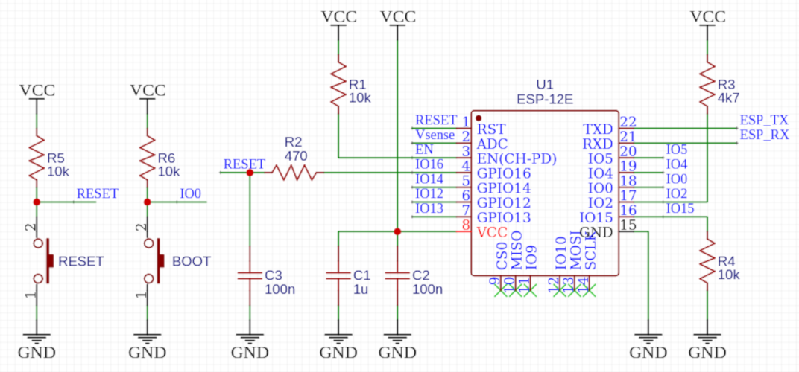

# HMI_CaptivePortal

__HMI_CaptivePortal__ is a Human Machine Interface system built with MicroPython.  
It will startup as a WiFi access point device. And a pop up webpage appears after connected with any type of mobile device.  
The webpage is fully customized to control hardware peripherals.

---

## Contents

1. Hardware
2. Dependencies
3. Source code description
4. Guide of the system
5. Done check list

---

### 1. Hardware

This system was developed on ESP-12F modeule.  
Checkout the [Document](https://www.google.com/url?sa=t&rct=j&q=&esrc=s&source=web&cd=&cad=rja&uact=8&ved=2ahUKEwiNxb_vtLz3AhUT4WEKHT9xCB0QFnoECAMQAQ&url=https%3A%2F%2Fdocs.ai-thinker.com%2F_media%2Fesp8266%2Fdocs%2Fesp-12f_product_specification_en.pdf&usg=AOvVaw2qVaxjxbbD463zz9tHMBif "AI-Thinker ESP-12F") or the schematic below to prepare hardware platform.  



---

### 2. Dependencies

| Part | Requires |
| ---- | -------- |
| Hardware | ESP8266 |
| Platform | MicroPython v1.17 |
| Libraries | machine, gc, network, scoket, select, uio, binascii and uerrno |

---

### 3. Source code description

1. index.html

    Here use AJAX to receive data, GET method to send data to hardware.

    To keep connected, using *setInterval( function(), ms)* to get data from /getData every 2000mS.

    ```javascript
    setInterval(function(){
      var xhttp=new XMLHttpRequest();
      xhttp.onreadystatechange=function(){
        if(this.readyState==4&&this.status==200){
          document.getElementById("text").innerHTML=this.responseText;
        }
      };
      xhttp.open("GET","/getData",true);
      xhttp.send();
    },2000);
    ```

    Here also need a block to display data from hardware and a form with GET method to send data if need.

    ```html
    <div id="text">Response data displayed here</div>
    ```
    ```html
    <form action="/setData" method="get">
      <input type="checkbox" value="GPIO0" /><label>GPIO0</label><br />
      <input type="checkbox" value="GPIO1" /><label>GPIO1</label><br />
      <button type="submit">Submit</button>
    </form>
    ```

2. main.py

    > In the *main.py*, this module will setup as a WiFi AP.

    CaptivePortal:
    - start(self,ip,submask,gateway,dns)
    - captive_portal(self)
    - handle_http(self,sock,event,others)
    - handle_dns(self,sock,event,others)
    - cleanup(self)

3. Server.py

    > in another

    Server:
    - stop(self,poller)

    DNSQuery:
    - answer(self,ip)

    DNSServer:
    - handle(self,sock,event,others)

    HTTPServer:
    - config(self,params)
    - title(self,params)
    - measure(self,params)
    - handle(self,sock,event,others)
    - accept(self,s)
    - parse_request(self,req)
    - get_response(self,req)
    - is_valid_req(self,req)
    - read(self,s)
    - prepare_write(self,s,body,headers)
    - write_to(self,sock)
    - buff_advance(self,c,bytes_written)
    - close(self,s)

4. httpHandler.py

    > in the other

---

### 4. Guide of the system

1. Power on

2. Connect to the system via WiFi client

> 3. The HMI webpage should automatically pop up

---

### 5. Done check list

- [ ] Startup as a WiFi AP
- [ ] Create http and dns service

---